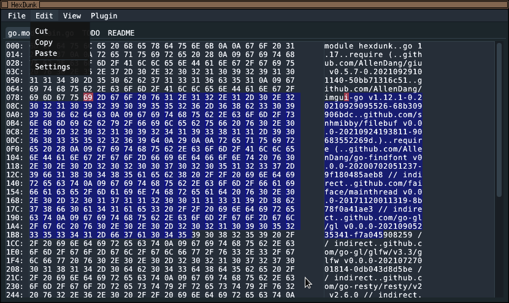
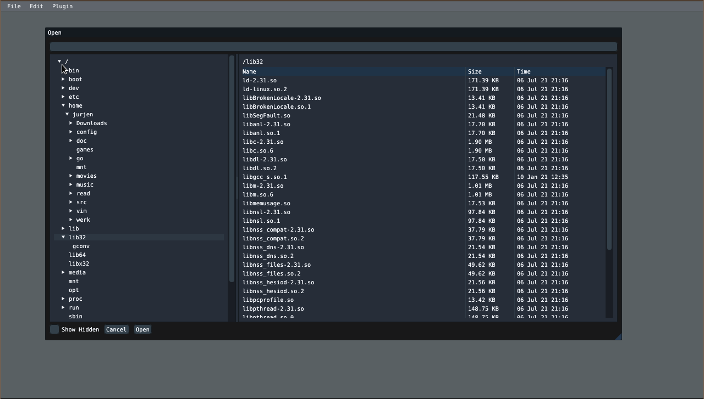

#Hexdunk
A simple but solid hex-editor with vi bindings

##Features
- Fast loading of arbitrary large files (currently limited to about 3GB because of problems with the imgui
  scrolling implementation. Will be fixed later to use home-made scrolling)
- Fast cut/copy/paste (in-program; not using system clipboard)
- Looks good (uses the my dear imgui library)
- Fully written in Go

It uses the excellent packages:
- "filebuf" (https://github.com/snhmibby/filebuf) for fast file loading and editing
- "filetree" (https://github.com/snhmibby/filetree) for a beautiful file-system dialog.

##Manual
The following operations are supported in the hex-window:
- left click: select byte with cursor
- right click: edit menu popup
- mouse dragging: select bytes
- shift clicking: extends selection

The following keys are bound (vi like)
- h,j,k,l: move around
- arrow keys: move around
- i: insert mode (insert bytes before the cursor)
- o: overwrite mode
- x: cut
- y: copy
- p: paste

##Installation
go get github.com/snhmibby/hexdunk

##Info &

