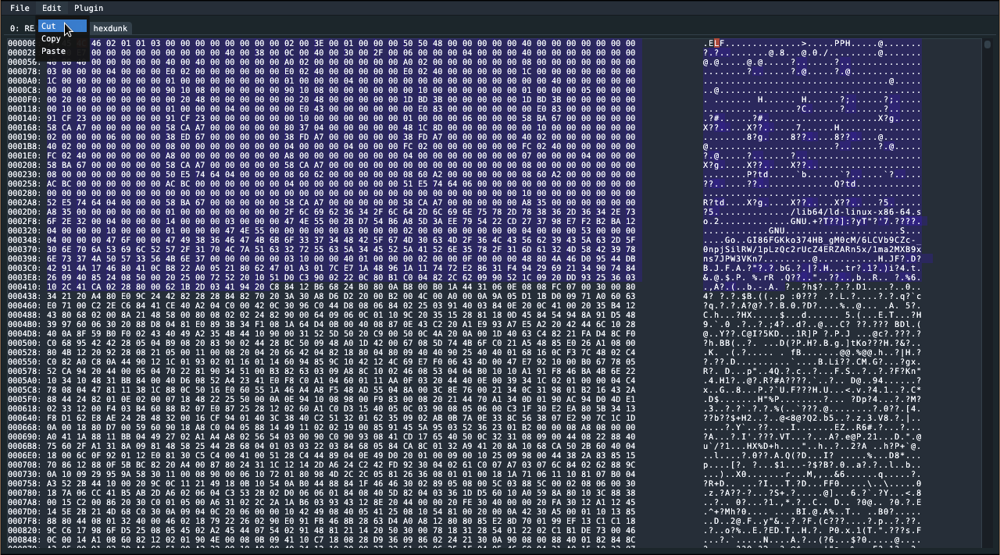

A work-in-progress hex-editor
Currently supports:
- Fast loading of arbitrary large files
- Fast cut/copy/paste
- Looks good
- Fully written in Go

It uses the excellent packages:
- "filebuf" (https://github.com/snhmibby/filebuf) for fast file loading and editing
- "filetree" (https://github.com/snhmibby/filetree) for a beautiful file-system dialog.

